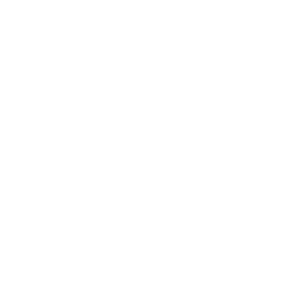
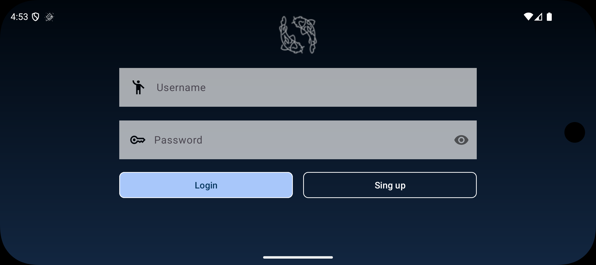
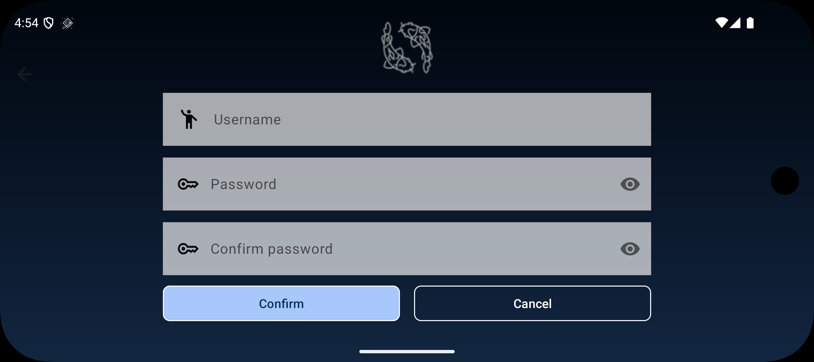

# NiceStart 

Este es un proyecto para la asignatura de Desarrollo de Interfaces. La idea es crear un prototipo de aplicación sencillo para practicar el diseño de layouts.

## Lenguajes
- Java
- XML

## Pantallas de la App

### Vista Vertical

| Login | Sign Up | Pantalla Principal |
| :---: | :---: | :---: |
|  |  |  |

### Vista Horizontal

| Login (Landscape) | Sign Up (Landscape) |
| :---: | :---: |
|  |  |

---

### Paleta de Colores

---

> [!NOTE]
> **Estado del proyecto**:
> Esta app es una práctica de clase que aun no esta finalizada.
